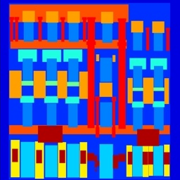
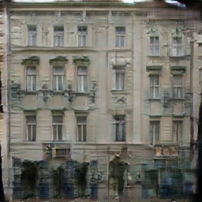

# PRODIGY_GA_04

## Image-to-Image Translation using Pix2Pix (cGAN)

### Objective
Implement an Image-to-Image Translation model using a Conditional Generative Adversarial Network (cGAN) called **Pix2Pix**. The model translates input images into realistic output images using a pre-trained Pix2Pix model.

---

## Technologies Used

- Python
- PyTorch
- Pix2Pix (cGAN)
- Google Colab
- OpenCV
- Matplotlib

---

## Dataset

- Pix2Pix Facades Dataset

---

## Steps Performed

1. Installed the required libraries.
2. Cloned the official Pix2Pix repository.
3. Downloaded the pre-trained Pix2Pix model.
4. Downloaded the Facades dataset.
5. Generated translated images using the Pix2Pix model.
6. Compared the input image, generated image, and ground truth image.

---

## Results

The model successfully translated facade label images into realistic building images.

### Sample Output

| Input Image | Generated Image | Ground Truth |
|-------------|-----------------|--------------|
|  |  |  |

---

## Project Structure

```
PRODIGY_GA_04/
│── PRODIGY_GA_04.ipynb
│── README.md
│── requirements.txt
└── outputs/
    ├── 100_real_A.png
    ├── 100_fake_B.png
    └── 100_real_B.png
```

---

## Conclusion

This project demonstrates image-to-image translation using the Pix2Pix conditional GAN. A pre-trained Pix2Pix model was used to generate realistic facade images from semantic label maps, showcasing the capabilities of conditional GANs for image translation tasks.
